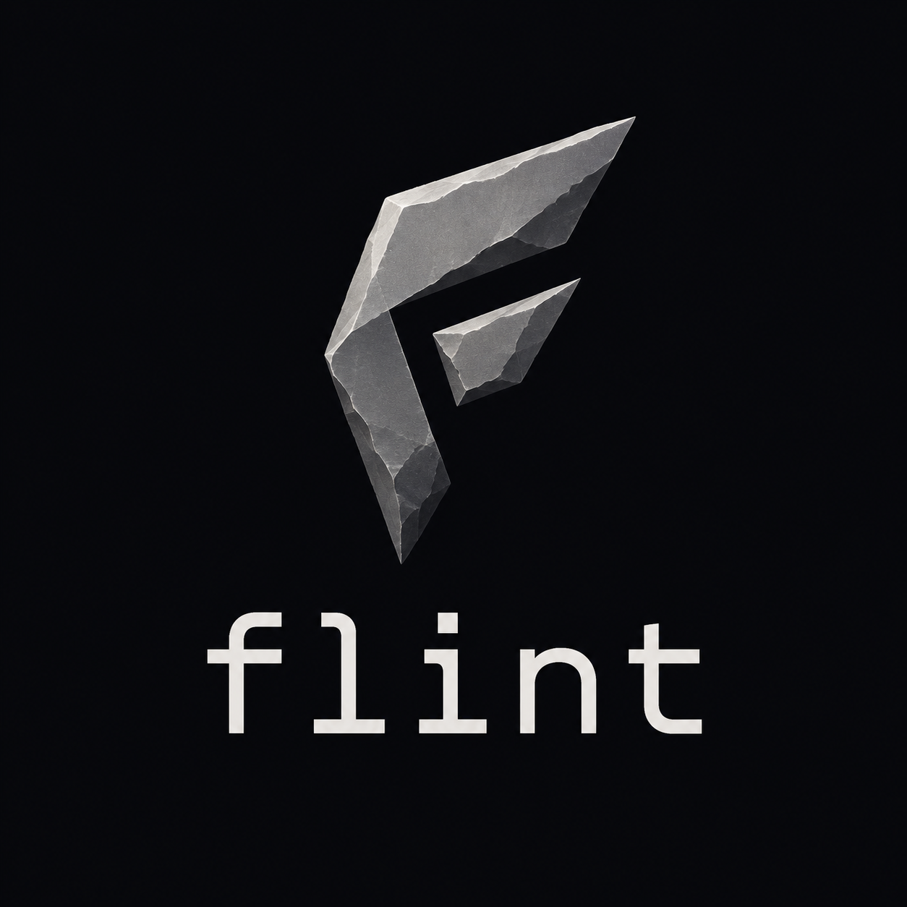

# Flint Programming Language

<div align="center">



**AI-first, production-ready, beginner-friendly**

[](LICENSE)
[](AGENT.md)
[](https://rust-lang.org)

</div>

## Overview

Flint is a modern general-purpose programming language designed to be:
- **AI-first**: Native AI integration, prompt execution, and agent declarations
- **Production-ready**: High performance with compiled execution
- **Beginner-friendly**: Clean syntax, strong type inference, helpful errors

## Features

### Modern Type System
- Static typing with full type inference (Hindley-Milner)
- Generic types, union types, nullable safety
- Interfaces, traits, and structs with methods

### Concurrency
- Async/await with lightweight coroutines
- CSP-style channels for message passing
- Actor-based concurrency model

### AI Integration
```flint
# Native AI prompts
let summary = await prompt("Summarize: ${text}", model: "claude-3")

# AI agents with tools
agent Researcher:
  tools: [web_search, read_file]
  async fn research(topic: Str) -> Report:
    let results = await self.web_search(topic)
    return summarize(results)
```

### Safety
- Memory safety via ownership model
- No null pointer exceptions
- Sandboxed execution with permissions

## Quick Start

### Installation

```sh
# Clone the repository
git clone https://github.com/flint-lang/flint.git
cd flint

# Build
cargo build --workspace

# Run examples
./target/debug/flint run examples/hello_world.flint
```

### Create a New Project

```sh
flint new my-app
cd my-app
flint run
```

### Interactive REPL

```sh
flint repl
```

## Syntax Examples

### Variables and Functions

```flint
let name = "Flint"
var count: Int = 0
const MAX: Int = 100

fn greet(name: Str, greeting: Str = "Hello") -> Str:
  return "${greeting}, ${name}!"
```

### Pattern Matching

```flint
match value:
  0       => "zero"
  1..10   => "small"
  Int     => "some integer"
  _       => "other"
```

### Data Types

```flint
# Struct
struct Point:
  x: Float
  y: Float

# Enum with associated values
enum Result<T, E>:
  Ok(value: T)
  Err(error: E)

# Interface
interface Serializable:
  fn toJson(self) -> Str
```

## Tooling

| Command | Description |
|---------|-------------|
| `flint new` | Create new project |
| `flint run` | Run main.flint |
| `flint build` | Build to native binary |
| `flint build --target wasm` | Build to WebAssembly |
| `flint test` | Run tests |
| `flint fmt` | Format code |
| `flint lint` | Lint code |
| `flint repl` | Interactive REPL |
| `flint lsp` | Start language server |
| `flint pkg` | Package manager |

## Standard Library

- **http** - HTTP client and server
- **db** - Database connectors (PostgreSQL, MySQL, SQLite, Redis)
- **json** - JSON parsing and serialization
- **fs** - File system operations
- **ai** - AI integration (OpenAI, Anthropic, Ollama)
- **security** - Sandbox, permissions, encryption

## Documentation

- [Language Specification](docs/spec.md)
- [API Reference](docs/api.md)
- [Examples](examples/)
- [VSCode Extension](vscode-extension/)

## Contributing

Contributions are welcome! Please read our [contributing guidelines](CONTRIBUTING.md) first.

## License

MIT License - see [LICENSE](LICENSE) file.
